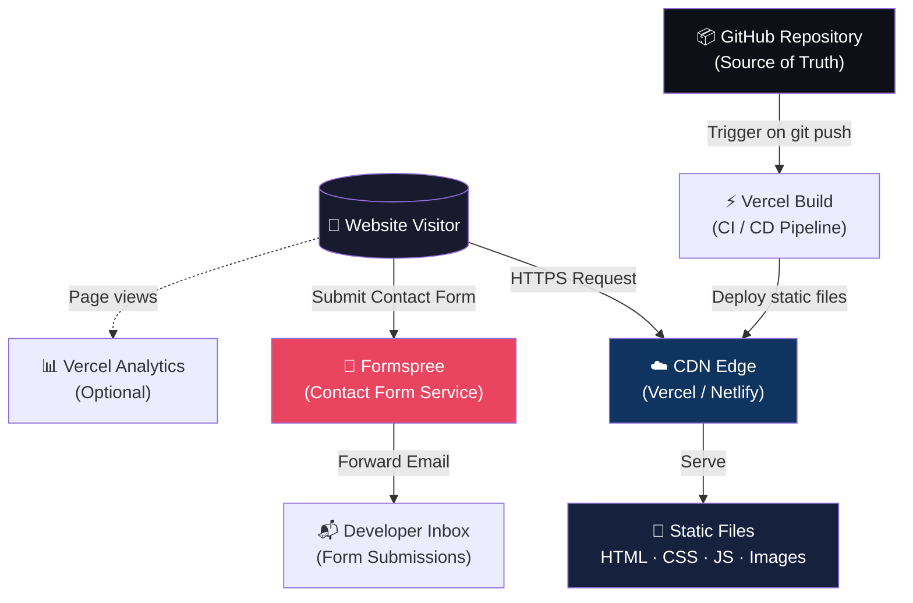

# SYSTEM_ARCHITECTURE.md

**The Big3 Digital Solution — Technical Architecture Reference**

> Static marketing and portfolio website built with Next.js App Router.
> No backend. No database. No authentication. Maximum performance.

Last updated: June 2026

---

## Table of Contents

1. [Project Overview](#1-project-overview)
2. [Technical Decisions](#2-technical-decisions)
3. [High-Level System Diagram](#3-high-level-system-diagram)
4. [Project Structure](#4-project-structure)
5. [Routing Architecture](#5-routing-architecture)
6. [Component Architecture](#6-component-architecture)
7. [Content Architecture](#7-content-architecture)
8. [Design System](#8-design-system)
9. [SEO Architecture](#9-seo-architecture)
10. [Accessibility Standards](#10-accessibility-standards)
11. [Performance Standards](#11-performance-standards)
12. [Coding Standards](#12-coding-standards)
13. [Deployment Architecture](#13-deployment-architecture)
14. [Security Considerations](#14-security-considerations)
15. [Future Roadmap](#15-future-roadmap)

---

## 1. Project Overview

### Overview

The Big3 Digital Solution website is a static marketing and portfolio website built with
Next.js App Router. The company provides website development, application development,
software development, and AI automation services.

**Primary goals:**

- Premium brand presentation with a unique 3D character mascot
- High performance — target 95+ Lighthouse score across all categories
- SEO optimization for "web development agency India" and related queries
- Easy content maintenance via TypeScript data files
- Future scalability without architectural changes

**The system intentionally avoids backend services, databases, and authentication to maximize
performance and deployment simplicity.**

### Scope (Phase 1 — Launch)

| In Scope                            | Out of Scope         |
| ----------------------------------- | -------------------- |
| Single landing page with 8 sections | CMS / admin panel    |
| Static contact form (Formspree)     | User accounts / auth |
| Portfolio project cards             | Blog (Phase 2)       |
| Service showcase                    | E-commerce           |
| AI automation highlight section     | Real-time features   |
| SEO metadata + sitemap              | Backend API          |

---

## 2. Technical Decisions

### Why Next.js

- **Static generation support** — `output: 'export'` produces pure HTML/CSS/JS with zero server
- **Excellent SEO** — server-rendered HTML ships to crawlers without JavaScript execution
- **Modern App Router** — file-system routing, layouts, and metadata APIs are all built in
- **Strong ecosystem** — first-class TypeScript, Tailwind CSS, Framer Motion integration
- **Future scalability** — adding API routes or server components requires zero refactor

### Why Tailwind CSS

- **Consistent design system** — design tokens enforced at utility level across every component
- **Faster development** — no context-switching between component files and stylesheets
- **Reduced CSS maintenance** — no specificity conflicts, no dead CSS accumulation
- **JIT compilation** — only the CSS classes actually used ship to production

### Why Static Export (`output: 'export'`)

- **Lowest hosting cost** — deploy to Vercel free tier, Netlify, or GitHub Pages
- **Maximum performance** — no server round-trip; files served directly from CDN edge
- **CDN friendly** — entire site cached globally, sub-50ms response from any location
- **Zero server maintenance** — no Node.js process to keep running, patch, or monitor
- **High availability** — static files on CDN have ~100% uptime; no server crash risk

### Why Formspree (Contact Form)

- **No backend required** — POST directly from browser to Formspree endpoint
- **Spam protection** — built-in honeypot and reCAPTCHA support
- **Email forwarding** — form submissions delivered to your inbox instantly
- **Free tier** — 50 submissions/month free, sufficient for initial launch
- **GDPR compliant** — Formspree handles data storage within compliance requirements

### Why Framer Motion + GSAP

- **Framer Motion** — React-native animation API, handles enter/exit animations with `whileInView`
- **GSAP + ScrollTrigger** — industry-standard for complex scroll-linked animations (like sohub.digital)
- **Lenis** — smooth scroll library that makes page scrolling feel premium and intentional
- **Combination** — Framer Motion for component animations, GSAP for scroll choreography

---

## 3. High-Level System Diagram

### Build Pipeline

```
┌─────────────────────────────────────────────────────────────┐
│                      DEVELOPMENT                            │
│                                                             │
│   TypeScript Source  ──►  Next.js Build  ──►  Static Out   │
│   Components                                 /out folder   │
│   Data Files                                 HTML/CSS/JS   │
│   Public Assets                              Sitemap.xml   │
└──────────────────────────┬──────────────────────────────────┘
                           │  git push / CI trigger
                           ▼
┌─────────────────────────────────────────────────────────────┐
│                   DEPLOYMENT (VERCEL)                        │
│                                                             │
│   GitHub Repo  ──►  Vercel Build  ──►  Global CDN Edge     │
│                      next build           200+ locations    │
│                      next export          < 50ms TTFB       │
└──────────────────────────┬──────────────────────────────────┘
                           │
                           ▼
┌─────────────────────────────────────────────────────────────┐
│                   RUNTIME (BROWSER)                          │
│                                                             │
│   User Browser  ──►  CDN Edge  ──►  Static HTML            │
│                                      + Hydration            │
│                                      + Framer Motion        │
│                                      + GSAP Scroll          │
└──────────────────────────┬──────────────────────────────────┘
                           │  Contact form POST
                           ▼
              ┌────────────────────────┐
              │   FORMSPREE SERVICE    │
              │   (Third Party)        │
              │   → Email to inbox     │
              └────────────────────────┘
```

### System Context Diagram



---

## 4. Project Structure

```
the-big3/
│
├── app/                              # Next.js App Router
│   ├── fonts/                        # Self-hosted font files (.woff2 preferred)
│   │   ├── NHaasGroteskTXPro-55Rg.woff2
│   │   ├── NHaasGroteskTXPro-65Md.woff2
│   │   ├── NHaasGroteskTXPro-75Bd.woff2
│   │   └── Teknaf-Regular.woff2
│   ├── layout.tsx                    # Root layout — fonts, metadata, providers
│   ├── page.tsx                      # Home landing page (imports all 8 sections)
│   ├── not-found.tsx                 # Custom 404 page
│   ├── sitemap.ts                    # Auto-generated sitemap.xml
│   ├── robots.ts                     # Auto-generated robots.txt
│   └── globals.css                   # Global styles, CSS custom properties
│
├── components/
│   ├── layout/                       # Persistent layout components
│   │   ├── Navbar.tsx                # Sticky navigation bar
│   │   ├── Footer.tsx                # Site footer
│   │   └── SmoothScrollProvider.tsx  # Lenis smooth scroll context
│   │
│   ├── sections/                     # Full-width page sections (used in page.tsx)
│   │   ├── Hero.tsx                  # 01 — Character + headline + CTAs
│   │   ├── About.tsx                 # 02 — Company story + values
│   │   ├── Services.tsx              # 03 — 4-card service grid
│   │   ├── AIAutomation.tsx          # 04 — AI automation differentiator
│   │   ├── Portfolio.tsx             # 05 — Project showcase grid
│   │   ├── Contact.tsx               # 06 — Formspree contact form
│   │   └── index.ts                  # Barrel exports
│   │
│   └── ui/                           # Reusable atomic components
│       ├── Button.tsx                # Primary / Ghost / Icon button variants
│       ├── Card.tsx                  # Service card + portfolio card
│       ├── SectionTitle.tsx          # Animated section heading + subheading
│       ├── AnimatedText.tsx          # Word-by-word or line-by-line text reveal
│       ├── Tag.tsx                   # Technology tag / service label
│       ├── CharacterImage.tsx        # Mascot wrapper with float animation
│       └── index.ts                  # Barrel exports
│
├── data/                             # Static content — edit here to update site
│   ├── services.ts                   # Service cards data
│   ├── portfolio.ts                  # Portfolio projects data
│   ├── navigation.ts                 # Nav links + CTA
│   └── company.ts                    # Company info, social links, contact details
│
├── hooks/                            # Custom React hooks
│   ├── useScrollAnimation.ts         # GSAP ScrollTrigger helpers
│   ├── useSmoothScroll.ts            # Lenis scroll utilities
│   └── useReducedMotion.ts           # Respects prefers-reduced-motion
│
├── lib/                              # Pure utility functions
│   ├── utils.ts                      # cn() (clsx + tailwind-merge), formatDate
│   └── constants.ts                  # Site URL, Formspree ID, brand name, section IDs
│
├── types/                            # TypeScript interfaces
│   ├── index.ts                      # Re-exports all types
│   ├── portfolio.ts                  # PortfolioProject, ProjectCategory
│   ├── services.ts                   # Service, ServiceFeature
│   └── navigation.ts                 # NavLink, FooterLink
│
├── public/                           # Static assets (served at root /)
│   ├── character.png                 # Brand mascot (2× resolution, transparent BG)
│   ├── logo.svg                      # Company logo (converted from .ai)
│   ├── favicon.ico                   # Browser tab icon
│   ├── apple-touch-icon.png          # iOS home screen icon (180×180)
│   ├── og-image.png                  # Open Graph social preview (1200×630)
│   └── images/
│       └── portfolio/                # Project screenshots (WebP preferred)
│           ├── project-1.webp
│           ├── project-2.webp
│           └── ...
│
├── next.config.ts                    # Next.js config — output: 'export'
├── tailwind.config.ts                # Theme tokens — colors, fonts, spacing
├── tsconfig.json                     # TypeScript config (strict mode)
├── .eslintrc.json                    # ESLint rules
├── .prettierrc                       # Code formatting rules
├── package.json
└── README.md
```

---

## 5. Routing Architecture

### Phase 1 Routes (Launch)

| URL            | File                | Description                 | Type      |
| -------------- | ------------------- | --------------------------- | --------- |
| `/`            | `app/page.tsx`      | Landing page (all sections) | Static    |
| `/404`         | `app/not-found.tsx` | Custom error page           | Static    |
| `/sitemap.xml` | `app/sitemap.ts`    | Auto-generated sitemap      | Generated |
| `/robots.txt`  | `app/robots.ts`     | Crawl directives            | Generated |

### Phase 2 Routes (Post-Launch)

| URL                   | File                              | Description            | Type         |
| --------------------- | --------------------------------- | ---------------------- | ------------ |
| `/work`               | `app/work/page.tsx`               | Full portfolio gallery | Static       |
| `/work/[slug]`        | `app/work/[slug]/page.tsx`        | Project detail page    | Static (SSG) |
| `/services`           | `app/services/page.tsx`           | Services overview      | Static       |
| `/services/[service]` | `app/services/[service]/page.tsx` | Service detail         | Static (SSG) |

### Static Export Configuration

```typescript
// next.config.ts
import type { NextConfig } from "next";

const nextConfig: NextConfig = {
  output: "export", // Enables static HTML export
  trailingSlash: true, // /about → /about/index.html (better compatibility)
  images: {
    unoptimized: true, // Required for static export on GitHub Pages
    // Remove this line if deploying to Vercel (handles optimization automatically)
  },
};

export default nextConfig;
```

### Phase 2 Dynamic Route — Static Params

```typescript
// app/work/[slug]/page.tsx
import { portfolioProjects } from "@/data/portfolio";

export async function generateStaticParams() {
  return portfolioProjects.map((project) => ({
    slug: project.slug,
  }));
}

export default function ProjectPage({ params }: { params: { slug: string } }) {
  const project = portfolioProjects.find((p) => p.slug === params.slug);
  // ...
}
```

### In-Page Navigation (Phase 1)

All navigation links on the landing page use anchor IDs for smooth scroll:

| Link Label    | Target ID        | Section Component  |
| ------------- | ---------------- | ------------------ |
| About         | `#about`         | `<About />`        |
| Services      | `#services`      | `<Services />`     |
| AI Automation | `#ai-automation` | `<AIAutomation />` |
| Portfolio     | `#portfolio`     | `<Portfolio />`    |
| Contact       | `#contact`       | `<Contact />`      |

---

## 6. Component Architecture

### Component Hierarchy

```
app/layout.tsx
└── SmoothScrollProvider (Lenis context)
    ├── Navbar
    │   ├── Logo (links to /)
    │   ├── NavLinks (anchors to section IDs)
    │   └── Button variant="primary"  ("Get in touch" → #contact)
    │
    ├── main
    │   ├── Hero (id="hero")
    │   │   ├── HeroContent (left column)
    │   │   │   ├── AnimatedText  (headline — word reveal)
    │   │   │   ├── p             (sub-headline)
    │   │   │   └── HeroCTAs
    │   │   │       ├── Button variant="primary"  ("See our work")
    │   │   │       └── Button variant="ghost"    ("Contact us")
    │   │   └── CharacterImage (right column, float animation)
    │   │
    │   ├── About (id="about")
    │   │   ├── SectionTitle
    │   │   └── AboutContent (stats + description)
    │   │
    │   ├── Services (id="services")
    │   │   ├── SectionTitle
    │   │   └── ServiceCard × 4
    │   │       ├── ServiceIcon
    │   │       ├── ServiceName
    │   │       ├── ServiceDescription
    │   │       └── ServiceFeatureList
    │   │
    │   ├── AIAutomation (id="ai-automation")
    │   │   ├── SectionTitle
    │   │   ├── AutomationFeatureGrid
    │   │   └── AutomationCTA
    │   │
    │   ├── Portfolio (id="portfolio")
    │   │   ├── SectionTitle
    │   │   └── PortfolioCard × n
    │   │       ├── ProjectImage (next/image)
    │   │       ├── ProjectTitle
    │   │       ├── ProjectDescription
    │   │       └── TechTagList
    │   │
    │   └── Contact (id="contact")
    │       ├── SectionTitle
    │       ├── ContactInfo (email, WhatsApp, location)
    │       └── ContactForm (Formspree endpoint)
    │           ├── input (name)
    │           ├── input (email)
    │           ├── input (subject)
    │           ├── textarea (message)
    │           └── Button type="submit"
    │
    └── Footer
        ├── FooterLogo
        ├── FooterNavLinks
        ├── FooterSocialLinks
        └── FooterCopyright
```

### Core UI Component Interfaces

```typescript
// components/ui/Button.tsx
interface ButtonProps {
  variant: "primary" | "ghost" | "icon";
  size?: "sm" | "md" | "lg";
  href?: string; // renders as <a> if provided
  onClick?: () => void;
  disabled?: boolean;
  loading?: boolean;
  className?: string;
  children: React.ReactNode;
}

// components/ui/Card.tsx
interface CardProps {
  variant: "service" | "portfolio";
  className?: string;
  children: React.ReactNode;
}

// components/ui/SectionTitle.tsx
interface SectionTitleProps {
  eyebrow?: string; // small label above headline (e.g., "What we do")
  headline: string;
  subheadline?: string;
  align?: "left" | "center";
  className?: string;
}

// components/ui/Tag.tsx
interface TagProps {
  label: string;
  variant?: "default" | "highlighted";
}
```

### Animation Pattern (Framer Motion)

All sections use the same enter animation — apply consistently:

```typescript
// hooks/useScrollAnimation.ts
import { useInView } from "framer-motion";
import { useRef } from "react";

const sectionVariants = {
  hidden: { opacity: 0, y: 32 },
  visible: {
    opacity: 1,
    y: 0,
    transition: { duration: 0.6, ease: [0.22, 1, 0.36, 1] },
  },
};

// Usage in any section component:
// <motion.div variants={sectionVariants} initial="hidden" whileInView="visible" viewport={{ once: true, margin: "-100px" }}>
```

---

## 7. Content Architecture

All content is stored in TypeScript data files under `/data/`. To update any content on
the site, edit these files and redeploy — no CMS required.

### Service Data

```typescript
// data/services.ts
export interface Service {
  id: string;
  icon: string; // Lucide icon name
  name: string;
  shortDescription: string;
  features: string[];
  highlighted: boolean; // true = "AI Automation" gets accent styling
}

export const services: Service[] = [
  {
    id: "web-development",
    icon: "Globe",
    name: "Website Development",
    shortDescription:
      "Fast, SEO-optimised websites built with modern frameworks.",
    features: [
      "Next.js / React",
      "Responsive design",
      "Performance-first",
      "CMS integration",
    ],
    highlighted: false,
  },
  {
    id: "app-development",
    icon: "Smartphone",
    name: "App Development",
    shortDescription: "Cross-platform mobile apps with native-quality UX.",
    features: [
      "React Native",
      "iOS & Android",
      "Offline support",
      "App Store deployment",
    ],
    highlighted: false,
  },
  {
    id: "software-development",
    icon: "Code2",
    name: "Software Development",
    shortDescription:
      "Custom software solutions built to your exact requirements.",
    features: [
      "Desktop apps",
      "SaaS platforms",
      "Enterprise tools",
      "API development",
    ],
    highlighted: false,
  },
  {
    id: "ai-automation",
    icon: "Bot",
    name: "AI Automation",
    shortDescription:
      "Automate repetitive workflows with intelligent AI pipelines.",
    features: [
      "LLM integration",
      "Process automation",
      "Custom AI agents",
      "Data pipelines",
    ],
    highlighted: true, // Accent card — this is the differentiator
  },
];
```

### Portfolio Data

```typescript
// data/portfolio.ts
export interface PortfolioProject {
  id: string;
  slug: string; // URL-safe identifier for Phase 2 detail pages
  title: string;
  client: string;
  category: "web" | "app" | "software" | "ai";
  shortDescription: string;
  fullDescription?: string; // Phase 2 — detail page
  image: string; // path relative to /public
  techStack: string[];
  liveUrl?: string;
  featured: boolean; // true = shown in landing page grid
}

export const portfolioProjects: PortfolioProject[] = [
  // Add your projects here
  // Example:
  {
    id: "1",
    slug: "project-name",
    title: "Project Title",
    client: "Client Name",
    category: "web",
    shortDescription: "One-line description of what was built.",
    image: "/images/portfolio/project-1.webp",
    techStack: ["Next.js", "TypeScript", "Tailwind"],
    liveUrl: "https://example.com",
    featured: true,
  },
];
```

### Company Data

```typescript
// data/company.ts
export const company = {
  name: "The Big 3",
  tagline: "We build websites, apps, and AI automation.",
  description:
    "A full-service digital agency specialising in modern web development and AI automation.",
  email: "hello@thebig3.com", // Update with real email
  whatsapp: "+91XXXXXXXXXX", // Update with real number
  location: "India",
  founded: 2024,
  socialLinks: {
    linkedin: "https://linkedin.com/company/thebig3",
    instagram: "https://instagram.com/thebig3",
    twitter: "https://twitter.com/thebig3",
    github: "https://github.com/thebig3",
  },
};

export const navigationLinks = [
  { label: "About", href: "#about" },
  { label: "Services", href: "#services" },
  { label: "AI Automation", href: "#ai-automation" },
  { label: "Portfolio", href: "#portfolio" },
  { label: "Contact", href: "#contact" },
];
```

### Site Configuration

No `.env.local` file is used in Phase 1–3. Every value below is **public** — it ends up
in the JS bundle regardless of whether it's an env var or a constant — so a typed constants
file is simpler than an environment file. Nothing to set on Vercel, nothing to forget,
nothing that silently becomes `undefined` if a deploy misses a step.

```typescript
// lib/constants.ts
export const SITE_URL = "https://thebig3.com"; // Update with your real domain
export const SITE_NAME = "The Big 3";

// Leave empty until you create a Formspree form.
// Contact.tsx checks this — if blank, it shows a "mailto:" link instead of the form.
export const FORMSPREE_ID = "";
```

> **Why not `.env.local`?** Env vars exist to keep secrets out of git and to vary config
> per environment. A static site with no database and no paid API key has nothing secret
> to protect — so the file would add a moving part without adding protection. If Phase 4
> introduces a database or a private API key, that's when `.env.local` becomes genuinely
> useful — see Section 15.

---

## 8. Design System

### Colour Tokens

Four of these values come directly from page 2 of `The_Big_3_Final_Logo.ai` — your
designer already produced a brand palette. The remaining three are neutrals derived to
complete a light theme (page background, muted text, hairline borders).

```typescript
// tailwind.config.ts (colour section)
colors: {
  brand: {
    // Neutrals — derived
    white:   '#FFFFFF',   // Page background
    paper:   '#FAF8FC',   // Alternating section background (barely-tinted white)
    border:  '#EAE3F1',   // Hairline dividers, input borders

    // From brand kit — exact
    ink:            '#120E1E', // Primary text, headings
    purple:         '#7562AB', // Primary accent — buttons, links, active states
    'purple-light': '#A392C6', // Secondary accent — hover, icons, tags, badges
    lavender:       '#E4D8EB', // Section backgrounds, card fills

    // Derived
    'ink-muted':    '#6B6678', // Secondary text, captions, descriptions
  },
},
```

**Contrast reference** — checked against WCAG 2.1 AA (4.5:1 normal text, 3:1 large text):

| Combination             | Ratio  | Use for                                 |
| ----------------------- | ------ | --------------------------------------- |
| `ink` on `white`        | 18.1:1 | Body text, headings — anywhere          |
| `purple` on `white`     | 5.2:1  | Links, icon-only buttons, small accents |
| `ink-muted` on `white`  | 5.6:1  | Secondary text, captions                |
| `ink` on `lavender`     | 13.5:1 | Section headings, card text             |
| `ink` on `purple-light` | 6.5:1  | Tags, badges, pills                     |
| `white` on `purple`     | 5.2:1  | Primary button text                     |

`purple-light` (#A392C6) only reaches 2.8:1 against white — **use it for fills and
decoration, not for text on a light background.** Pair it with `ink` text on top of it
instead (see badge example below).

### Typography Scale

### Typography — Font Files

#### Folder structure

Place all font files inside `app/fonts/`. Next.js processes fonts from here at build time
— they are never served from `public/` which would bypass optimisation.

```
app/
└── fonts/
    ├── NHaasGroteskTXPro-45Lt.woff2     ← Light 300 (optional)
    ├── NHaasGroteskTXPro-55Rg.woff2     ← Regular 400  ← minimum required
    ├── NHaasGroteskTXPro-65Md.woff2     ← Medium 500   ← minimum required
    ├── NHaasGroteskTXPro-75Bd.woff2     ← Bold 700     ← minimum required
    └── Teknaf-Regular.woff2              ← Display (for headings)
```

> **File format**: If your font files are `.otf` or `.ttf`, convert them to `.woff2`
> first — it is 30–40% smaller and is the only format all modern browsers need.
> Use [Transfonter](https://transfonter.org) (free, browser-based) or
> `npx font-squirrel` locally. `next/font/local` accepts `.otf` and `.ttf` too if you
> want to skip the conversion step — just update the `src` paths below.

#### Loading in `app/layout.tsx`

```typescript
// app/layout.tsx
import localFont from 'next/font/local'

// Neue Haas Grotesk Text Pro — body font
const nhGrotesk = localFont({
  src: [
    {
      path: './fonts/NHaasGroteskTXPro-55Rg.woff2',
      weight: '400',
      style: 'normal',
    },
    {
      path: './fonts/NHaasGroteskTXPro-65Md.woff2',
      weight: '500',
      style: 'normal',
    },
    {
      path: './fonts/NHaasGroteskTXPro-75Bd.woff2',
      weight: '700',
      style: 'normal',
    },
  ],
  variable: '--font-primary',   // CSS custom property name
  display: 'swap',              // Show fallback font immediately; swap when loaded
  preload: true,                // Preload — this is the body font, used everywhere
})

// Teknaf — display font for large headings only
const teknaf = localFont({
  src: './fonts/Teknaf-Regular.woff2',
  variable: '--font-display',
  display: 'swap',
  preload: false,               // Not preloaded — only used above the fold in Hero
})

export default function RootLayout({ children }: { children: React.ReactNode }) {
  return (
    <html lang="en" className={`${nhGrotesk.variable} ${teknaf.variable}`}>
      <body className="font-sans">   {/* font-sans picks up --font-primary via Tailwind */}
        {children}
      </body>
    </html>
  )
}
```

> **`preload: false` on Teknaf** — display fonts are large and only used in the Hero
> headline. Preloading a font that only appears in one element wastes bandwidth on every
> page. The `display: 'swap'` already handles the flash gracefully.

#### Tailwind config — connecting variables to utilities

```typescript
// tailwind.config.ts (font section)
fontFamily: {
  display: ['var(--font-display)', 'ui-sans-serif', 'system-ui', 'sans-serif'],
  sans:    ['var(--font-primary)', 'ui-sans-serif', 'system-ui', 'sans-serif'],
  mono:    ['ui-monospace', 'SFMono-Regular', 'Menlo', 'monospace'],
},
```

**Usage in components:**

| Tailwind class | Font loaded                | Typical use                               |
| -------------- | -------------------------- | ----------------------------------------- |
| `font-sans`    | Neue Haas Grotesk Text Pro | Body text, nav, buttons, labels — default |
| `font-display` | Teknaf                     | Hero headline only (`<h1>`)               |
| `font-mono`    | System monospace           | Code blocks only                          |

```tsx
// Hero.tsx — only place font-display is used
<h1 className="font-display text-display-xl text-brand-ink">
  Think big. We do the rest.
</h1>

// Everything else uses font-sans (set on <body>, inherited automatically)
<p className="text-body-lg text-brand-ink-muted">
  We build websites, apps, software, and AI automation.
</p>
```

### Font Size Scale

```typescript
// tailwind.config.ts (fontSize section)
fontSize: {
  'display-xl': ['clamp(3rem, 8vw, 6rem)',     { lineHeight: '1.0', letterSpacing: '-0.03em' }],
  'display-lg': ['clamp(2rem, 5vw, 4rem)',     { lineHeight: '1.1', letterSpacing: '-0.02em' }],
  'display-md': ['clamp(1.5rem, 3vw, 2.5rem)', { lineHeight: '1.2', letterSpacing: '-0.015em'}],
  'body-xl':    ['1.25rem',                    { lineHeight: '1.7' }],
  'body-lg':    ['1.125rem',                   { lineHeight: '1.7' }],
  'body-md':    ['1rem',                       { lineHeight: '1.7' }],
  'body-sm':    ['0.875rem',                   { lineHeight: '1.5' }],
  'label':      ['0.75rem',                    { lineHeight: '1.4', letterSpacing: '0.08em' }],
},
```

All spacing uses a base-8 scale. Do not use arbitrary values outside this table:

| Token      | px    | Usage                                      |
| ---------- | ----- | ------------------------------------------ |
| `space-2`  | 8px   | Inner padding, gaps between tight elements |
| `space-4`  | 16px  | Standard gap, small padding                |
| `space-6`  | 24px  | Card padding, medium gaps                  |
| `space-8`  | 32px  | Section inner padding                      |
| `space-12` | 48px  | Between components                         |
| `space-16` | 64px  | Section vertical padding (mobile)          |
| `space-24` | 96px  | Section vertical padding (desktop)         |
| `space-32` | 128px | Hero section top padding                   |

### Component Variants

```typescript
// tailwind.config.ts (plugin section or globals.css)
// Button variants — use with cva() from 'class-variance-authority'
const buttonVariants = cva(
  "inline-flex items-center justify-center font-medium transition-all duration-200 rounded-lg",
  {
    variants: {
      variant: {
        primary:
          "bg-brand-purple text-white hover:bg-brand-ink active:scale-95",
        ghost:
          "border border-brand-ink/15 text-brand-ink hover:bg-brand-lavender active:scale-95",
        accent:
          "bg-brand-lavender text-brand-purple hover:bg-brand-purple-light active:scale-95",
      },
      size: {
        sm: "px-4 py-2 text-body-sm",
        md: "px-6 py-3 text-body-md",
        lg: "px-8 py-4 text-body-lg",
      },
    },
    defaultVariants: { variant: "primary", size: "md" },
  },
);
```

### Character Animation

> **Asset check for light theme**: the mascot render currently has a solid dark
> background. On a white/lavender page, a dark rectangle behind the character will look
> like a bug, not a design choice. Before using it, export a version with a **transparent
> background** (PNG with alpha) — either re-export from the source render, or run it
> through a background remover (e.g. remove.bg, or Photoshop's Select Subject). Save the
> transparent version as `public/character.png`.

The mascot uses a gentle floating animation defined globally in `globals.css`. A soft
shadow is added beneath it so it feels grounded against the light background rather than
floating in empty space:

```css
/* globals.css */
@keyframes float {
  0%,
  100% {
    transform: translateY(0px) rotate(0deg);
  }
  33% {
    transform: translateY(-12px) rotate(0.5deg);
  }
  66% {
    transform: translateY(-6px) rotate(-0.5deg);
  }
}

.character-float {
  animation: float 4s ease-in-out infinite;
  will-change: transform;
  filter: drop-shadow(0 24px 32px rgba(18, 14, 30, 0.12));
}

@media (prefers-reduced-motion: reduce) {
  .character-float {
    animation: none;
  }
}
```

---

## 9. SEO Architecture

### Metadata Strategy

```typescript
// app/layout.tsx
import type { Metadata } from "next";
import { company } from "@/data/company";
import { SITE_URL } from "@/lib/constants";

export const metadata: Metadata = {
  metadataBase: new URL(SITE_URL),
  title: {
    default: "The Big 3 — Web, App & AI Automation Development",
    template: "%s | The Big 3",
  },
  description:
    "The Big 3 is a full-service digital agency in India specialising in website development, app development, software development, and AI automation.",
  keywords: [
    "web development agency India",
    "app development company",
    "AI automation development",
    "software development India",
    "Next.js development",
    "React development agency",
  ],
  authors: [{ name: "The Big 3", url: SITE_URL }],
  creator: "The Big 3",
  openGraph: {
    type: "website",
    locale: "en_IN",
    url: SITE_URL,
    siteName: "The Big 3",
    title: "The Big 3 — Web, App & AI Automation Development",
    description:
      "Full-service digital agency. Websites, apps, software, and AI automation built to your exact requirements.",
    images: [
      {
        url: "/og-image.png", // 1200×630 px — create this asset
        width: 1200,
        height: 630,
        alt: "The Big 3 — Digital Agency",
      },
    ],
  },
  twitter: {
    card: "summary_large_image",
    title: "The Big 3 — Web, App & AI Automation Development",
    description: "Full-service digital agency in India.",
    images: ["/og-image.png"],
    creator: "@thebig3", // Update with real handle
  },
  robots: {
    index: true,
    follow: true,
    googleBot: { index: true, follow: true, "max-video-preview": -1 },
  },
  verification: {
    google: "YOUR_GOOGLE_SEARCH_CONSOLE_TOKEN", // Add after launch
  },
};
```

### Sitemap Generation

```typescript
// app/sitemap.ts
import type { MetadataRoute } from "next";
import { SITE_URL } from "@/lib/constants";

export default function sitemap(): MetadataRoute.Sitemap {
  return [
    {
      url: SITE_URL,
      lastModified: new Date(),
      changeFrequency: "monthly",
      priority: 1.0,
    },
  ];
  // Phase 2: map portfolio projects and service pages here
}
```

### Robots Directives

```typescript
// app/robots.ts
import type { MetadataRoute } from "next";
import { SITE_URL } from "@/lib/constants";

export default function robots(): MetadataRoute.Robots {
  return {
    rules: { userAgent: "*", allow: "/" },
    sitemap: `${SITE_URL}/sitemap.xml`,
  };
}
```

### Structured Data (JSON-LD)

Add a `<script type="application/ld+json">` to `app/layout.tsx` for LocalBusiness schema:

```typescript
// app/layout.tsx (inside <head> via metadata or <script> tag)
const jsonLd = {
  "@context": "https://schema.org",
  "@type": "ProfessionalService",
  name: "The Big 3",
  description:
    "Full-service digital agency specialising in web, app, software, and AI automation.",
  url: siteUrl,
  logo: `${siteUrl}/logo.svg`,
  contactPoint: {
    "@type": "ContactPoint",
    contactType: "Sales",
    email: "hello@thebig3.com",
    availableLanguage: "English",
  },
  sameAs: [
    "https://linkedin.com/company/thebig3",
    "https://instagram.com/thebig3",
  ],
};
```

### SEO Checklist

- [ ] OG image created at 1200×630 px and placed at `public/og-image.png`
- [ ] Favicon and apple-touch-icon added to `public/`
- [ ] `<h1>` used exactly once per page (in Hero)
- [ ] All images have `alt` text
- [ ] All sections have semantic HTML tags (`<section>`, `<article>`, `<aside>`)
- [ ] Google Search Console verified after first deployment
- [ ] Core Web Vitals checked in PageSpeed Insights after launch
- [ ] Canonical URL set in metadata

---

## 10. Accessibility Standards

**Target:** WCAG 2.1 Level AA compliance.

### Semantic HTML Rules

```
<header>        → Navbar
<main>          → All sections (wraps Hero through Contact)
<section>       → Each individual section (Hero, About, Services, etc.)
<h1>            → Page headline in Hero — ONE per page only
<h2>            → Section titles
<h3>            → Card titles (Service cards, Portfolio cards)
<footer>        → Footer component
<nav>           → Navigation links in Navbar and Footer
<a>             → All navigation links (anchor tags, not buttons)
<button>        → Only for actions (form submit, open modal)
```

### Keyboard Navigation

- All interactive elements reachable via `Tab` key
- Visible focus ring on all focusable elements
- Skip-to-content link as first focusable element in DOM:

```tsx
// app/layout.tsx — first element inside <body>
<a
  href="#main"
  className="sr-only focus:not-sr-only focus:absolute focus:top-4 focus:left-4 focus:z-50 focus:bg-white focus:text-black focus:px-4 focus:py-2 focus:rounded"
>
  Skip to main content
</a>
```

### Colour Contrast

| Element                         | Minimum Ratio | Target |
| ------------------------------- | ------------- | ------ |
| Body text on dark bg            | 4.5:1         | AA     |
| Large headings on dark bg       | 3:1           | AA     |
| Button text on primary button   | 4.5:1         | AA     |
| Placeholder text in form inputs | 3:1           | AA     |

Use the WebAIM Contrast Checker to verify all colour combinations before launch.

### Motion Accessibility

All animations must respect `prefers-reduced-motion`:

```typescript
// hooks/useReducedMotion.ts
import { useEffect, useState } from "react";

export function useReducedMotion(): boolean {
  const [reducedMotion, setReducedMotion] = useState(false);
  useEffect(() => {
    const mq = window.matchMedia("(prefers-reduced-motion: reduce)");
    setReducedMotion(mq.matches);
    const handler = (e: MediaQueryListEvent) => setReducedMotion(e.matches);
    mq.addEventListener("change", handler);
    return () => mq.removeEventListener("change", handler);
  }, []);
  return reducedMotion;
}
```

### Form Accessibility

```tsx
// components/sections/Contact.tsx — form field pattern
<div>
  <label htmlFor="email" className="block text-body-sm mb-1">
    Email address <span aria-hidden="true">*</span>
  </label>
  <input
    id="email"
    type="email"
    name="email"
    required
    aria-required="true"
    aria-describedby="email-error"
    autoComplete="email"
    className="w-full ..."
  />
  <p
    id="email-error"
    role="alert"
    className="text-red-400 text-body-sm mt-1 hidden"
  >
    Please enter a valid email address.
  </p>
</div>
```

### Accessibility Checklist

- [ ] Skip-to-content link implemented
- [ ] All images have descriptive `alt` attributes (decorative images use `alt=""`)
- [ ] Form fields have associated `<label>` elements with `htmlFor`
- [ ] Error messages use `role="alert"`
- [ ] Focus styles visible and clear (not overridden with `outline: none`)
- [ ] Colour contrast ratios verified (WebAIM Contrast Checker)
- [ ] Character image has appropriate alt text: `alt="The Big 3 mascot character"`
- [ ] Animation respects `prefers-reduced-motion`
- [ ] Tested with keyboard-only navigation
- [ ] Tested with VoiceOver (Mac) or NVDA (Windows)

---

## 11. Performance Standards

### Core Web Vitals Targets

| Metric                                | Good    | Target  | Tool               |
| ------------------------------------- | ------- | ------- | ------------------ |
| LCP (Largest Contentful Paint)        | < 2.5s  | < 1.5s  | PageSpeed Insights |
| FID / INP (Interaction to Next Paint) | < 200ms | < 100ms | PageSpeed Insights |
| CLS (Cumulative Layout Shift)         | < 0.1   | < 0.05  | PageSpeed Insights |
| TTFB (Time to First Byte)             | < 800ms | < 100ms | WebPageTest        |
| FCP (First Contentful Paint)          | < 1.8s  | < 1.2s  | Lighthouse         |

**Lighthouse Score Target:** 95+ on Performance, Accessibility, Best Practices, SEO.

### Image Optimisation

- Export all portfolio images as **WebP** at maximum 1200px wide
- Character image: minimum 600px tall, transparent PNG, compressed with TinyPNG
- OG image: exactly 1200×630 px, JPG or PNG, under 300KB
- Use Next.js `<Image>` component for all images — it handles lazy loading and sizing:

```tsx
import Image from "next/image";

// In components/ui/CharacterImage.tsx
<Image
  src="/character.png"
  alt="The Big 3 mascot — a 3D animated developer character"
  width={500}
  height={700}
  priority // Add priority only for hero image (above fold)
  className="character-float"
/>;
```

### Font Loading Strategy

```typescript
// app/layout.tsx
import { Inter, Syne } from "next/font/google";

const bodyFont = Inter({
  subsets: ["latin"],
  display: "swap", // Prevents FOIT (flash of invisible text)
  variable: "--font-primary",
});

const displayFont = Syne({
  subsets: ["latin"],
  weight: ["700", "800"],
  display: "swap",
  variable: "--font-display",
});
```

> **Replace Inter / Syne** with your actual brand fonts. `next/font` automatically
> self-hosts Google Fonts and subsets them — zero network request to Google.

### Performance Checklist

- [ ] `next build` produces no warnings about large bundle sizes
- [ ] Font files are `.woff2` format and placed in `app/fonts/` (not `public/`)
- [ ] `nhGrotesk` has `preload: true`; `teknaf` has `preload: false`
- [ ] Character PNG compressed to under 500KB (use TinyPNG)
- [ ] Character PNG has transparent background (no dark rectangle behind mascot)
- [ ] All portfolio images converted to WebP
- [ ] No unused Tailwind classes (PurgeCSS handled automatically by Tailwind v4)
- [ ] Hero image uses `priority` prop; all below-fold images use default (lazy)
- [ ] No render-blocking third-party scripts
- [ ] GSAP and Framer Motion animations use `transform` and `opacity` only (GPU-composited)
- [ ] `will-change: transform` applied to character image
- [ ] Lighthouse score verified in production (not development) build

---

## 12. Coding Standards

### TypeScript Configuration

```json
// tsconfig.json — strict mode enabled
{
  "compilerOptions": {
    "strict": true,
    "noUncheckedIndexedAccess": true,
    "noImplicitReturns": true,
    "exactOptionalPropertyTypes": true
  }
}
```

**Rules:**

- No `any` types — use `unknown` and narrow, or define a proper interface
- No `!` non-null assertions — handle nullability explicitly
- All component props must have explicit TypeScript interfaces or types
- All exported data files must have explicit return types

### File and Folder Naming

| Type            | Convention                                      | Example                         |
| --------------- | ----------------------------------------------- | ------------------------------- |
| Components      | PascalCase                                      | `ServiceCard.tsx`               |
| Hooks           | camelCase with `use` prefix                     | `useScrollAnimation.ts`         |
| Utilities       | camelCase                                       | `utils.ts`                      |
| Data files      | camelCase                                       | `portfolio.ts`                  |
| Type files      | camelCase                                       | `portfolio.ts`                  |
| Constants       | SCREAMING_SNAKE_CASE (values), camelCase (file) | `SECTION_IDS` in `constants.ts` |
| CSS class names | kebab-case                                      | `character-float`               |

### Component Rules

```typescript
// ✅ Correct — named export, explicit props interface, no default props
export interface SectionTitleProps {
  headline: string
  subheadline?: string
  align?: 'left' | 'center'
}

export function SectionTitle({ headline, subheadline, align = 'left' }: SectionTitleProps) {
  return (
    <div className={align === 'center' ? 'text-center' : 'text-left'}>
      <h2 className="...">{headline}</h2>
      {subheadline && <p className="...">{subheadline}</p>}
    </div>
  )
}

// ❌ Wrong — default export, inline type, missing explicit types
export default function SectionTitle(props: any) { ... }
```

### Import Order (enforced by ESLint)

```typescript
// 1. React / Next.js
import { useState, useEffect } from "react";
import Image from "next/image";
import Link from "next/link";

// 2. Third-party libraries
import { motion } from "framer-motion";
import { gsap } from "gsap";

// 3. Internal aliases (configured in tsconfig.json paths)
import { Button } from "@/components/ui";
import { services } from "@/data/services";
import { cn } from "@/lib/utils";

// 4. Types
import type { Service } from "@/types/services";
```

### Utility Function

```typescript
// lib/utils.ts
import { clsx, type ClassValue } from "clsx";
import { twMerge } from "tailwind-merge";

// Use this everywhere instead of template string class names
export function cn(...inputs: ClassValue[]): string {
  return twMerge(clsx(inputs));
}
```

### ESLint Rules (`.eslintrc.json`)

```json
{
  "extends": ["next/core-web-vitals", "plugin:@typescript-eslint/recommended"],
  "rules": {
    "@typescript-eslint/no-explicit-any": "error",
    "@typescript-eslint/explicit-function-return-type": "off",
    "prefer-const": "error",
    "no-console": ["warn", { "allow": ["warn", "error"] }],
    "react/self-closing-comp": "error"
  }
}
```

---

## 13. Deployment Architecture

### Production Stack

```
Source Code (GitHub)
      │
      │  git push to main
      ▼
Vercel CI/CD Pipeline
  ├── Install dependencies (npm ci)
  ├── Run type check (tsc --noEmit)
  ├── Run linter (eslint .)
  ├── next build
  ├── Output: /out static files
  └── Deploy to Vercel Edge CDN
            │
            └── Available at thebig3.com
                (200+ global edge locations)
```

### Vercel Configuration (`vercel.json`)

```json
{
  "headers": [
    {
      "source": "/(.*)",
      "headers": [
        { "key": "X-Content-Type-Options", "value": "nosniff" },
        { "key": "X-Frame-Options", "value": "DENY" },
        { "key": "X-XSS-Protection", "value": "1; mode=block" },
        {
          "key": "Referrer-Policy",
          "value": "strict-origin-when-cross-origin"
        },
        {
          "key": "Permissions-Policy",
          "value": "camera=(), microphone=(), geolocation=()"
        }
      ]
    },
    {
      "source": "/images/(.*)",
      "headers": [
        {
          "key": "Cache-Control",
          "value": "public, max-age=31536000, immutable"
        }
      ]
    }
  ]
}
```

### Deployment Environments

| Environment | Branch      | URL                              | Purpose   |
| ----------- | ----------- | -------------------------------- | --------- |
| Production  | `main`      | `thebig3.com`                    | Live site |
| Preview     | `feature/*` | `thebig3-git-feature.vercel.app` | PR review |
| Development | local       | `localhost:3000`                 | Local dev |

### CI/CD Flow

```bash
# Developer workflow:
git checkout -b feature/new-section
# make changes
git push origin feature/new-section
# → Vercel creates a preview deployment automatically
# → Review at preview URL
# → Merge PR to main
# → Vercel deploys to production automatically
```

### Alternative Deployment Targets

If not using Vercel, these platforms also support static export:

| Platform                | Cost        | Configuration                                      |
| ----------------------- | ----------- | -------------------------------------------------- |
| **Netlify**             | Free tier   | Add `netlify.toml`, use `next build`               |
| **GitHub Pages**        | Free        | Add `.github/workflows/deploy.yml`, set `basePath` |
| **Cloudflare Pages**    | Free tier   | Connect GitHub repo, build command `next build`    |
| **AWS S3 + CloudFront** | ~$1–5/month | Upload `/out` to S3, serve via CloudFront          |

---

## 14. Security Considerations

Even as a fully static site with no backend, the following security practices apply:

### HTTP Security Headers

All headers are configured in `vercel.json` (see Section 13). Key headers:

| Header                   | Value                             | Protection Against          |
| ------------------------ | --------------------------------- | --------------------------- |
| `X-Content-Type-Options` | `nosniff`                         | MIME type sniffing attacks  |
| `X-Frame-Options`        | `DENY`                            | Clickjacking                |
| `X-XSS-Protection`       | `1; mode=block`                   | Legacy XSS filter           |
| `Referrer-Policy`        | `strict-origin-when-cross-origin` | Referrer data leakage       |
| `Permissions-Policy`     | Restrict camera/mic/geo           | Unwanted browser API access |

### Content Security Policy

Add CSP header to `vercel.json` (tighten as needed):

```json
{
  "key": "Content-Security-Policy",
  "value": "default-src 'self'; script-src 'self' 'unsafe-eval' 'unsafe-inline'; style-src 'self' 'unsafe-inline'; img-src 'self' data: blob:; font-src 'self'; connect-src 'self' https://formspree.io; frame-ancestors 'none';"
}
```

### Configuration Security

- Phase 1–3 uses **no `.env.local`** — all public config (`SITE_URL`, `FORMSPREE_ID`) lives
  in `lib/constants.ts` and is committed to git. This is safe because none of it is secret:
  a site URL and a Formspree form ID carry no risk if visible in source.
- The Formspree form ID is public by design — Formspree handles abuse prevention on its side
- **Never** store private API keys, database credentials, or any real secret in this
  repository while it remains static. If Phase 4 adds a backend, **that's** the point to
  introduce `.env.local` + `.gitignore` for the first time — see Section 15.

### Contact Form Security

Formspree handles:

- **CORS** — only accepts submissions from your configured domain
- **Spam filtering** — built-in honeypot field support
- **Rate limiting** — prevents form flooding
- **GDPR** — EU data processing compliant

Add a honeypot field to your form to catch bots:

```tsx
{
  /* Hidden honeypot — bots fill this, humans don't */
}
<input
  type="text"
  name="_gotcha"
  style={{ display: "none" }}
  tabIndex={-1}
  autoComplete="off"
/>;
```

### Dependency Security

```bash
# Run regularly (add to pre-push hook or CI):
npm audit                    # Check for known vulnerabilities
npm outdated                 # Review available updates
```

Set up **Dependabot** in GitHub (`Settings → Security → Dependabot`) for automated
dependency update PRs.

### Security Checklist

- [ ] Security headers configured in `vercel.json`
- [ ] Formspree domain allowlist set to production domain only
- [ ] Honeypot field added to contact form
- [ ] No real secrets (API keys, credentials) anywhere in the repository
- [ ] Dependabot alerts enabled on GitHub
- [ ] HTTPS enforced (automatic on Vercel)
- [ ] `npm audit` returns zero high/critical vulnerabilities

---

## 15. Future Roadmap

### Phase 2 — Content Expansion (when 5+ portfolio projects available)

| Feature                     | Description                            | Files to Add                         |
| --------------------------- | -------------------------------------- | ------------------------------------ |
| `/work` gallery page        | Full portfolio with category filtering | `app/work/page.tsx`                  |
| `/work/[slug]` detail page  | Individual project case studies        | `app/work/[slug]/page.tsx`           |
| `/services/[service]` pages | Dedicated landing page per service     | `app/services/[service]/page.tsx`    |
| Portfolio filter            | Filter by Web / App / Software / AI    | Client-side state in `Portfolio.tsx` |

### Phase 3 — Growth Features

| Feature                | Description                | Dependency                        |
| ---------------------- | -------------------------- | --------------------------------- |
| Blog / Articles        | Technical content for SEO  | Add MDX support (`@next/mdx`)     |
| Testimonials section   | Client quotes with photos  | Add `data/testimonials.ts`        |
| Case study pages       | Detailed project write-ups | Phase 2 `/work/[slug]`            |
| Analytics dashboard    | Traffic insights           | Add Vercel Analytics or Plausible |
| Multi-language         | Hindi + English support    | Add `next-intl`                   |
| Dark/Light mode toggle | System preference + manual | Add `next-themes`                 |

### Phase 4 — If Backend is Ever Needed

This architecture was intentionally designed to make backend introduction surgical:

1. Create `.env.local` (add to `.gitignore`) for the first real secrets — database URL, API keys
2. Remove `output: 'export'` from `next.config.ts`
3. API routes become available at `app/api/`
4. Move form handling from Formspree to a custom `app/api/contact/route.ts`
5. Add database if required (Planetscale, Supabase, or Neon)
6. No component changes needed — the frontend is already structured correctly

### Maintenance Schedule

| Task                                                         | Frequency              |
| ------------------------------------------------------------ | ---------------------- |
| `npm audit` + security review                                | Monthly                |
| Update portfolio projects in `data/portfolio.ts`             | Per project completion |
| Review and update service descriptions in `data/services.ts` | Quarterly              |
| Check Core Web Vitals in PageSpeed Insights                  | Monthly                |
| Renew domain                                                 | Annually               |
| Review and update dependencies                               | Monthly                |

---

## Appendix A — Quick Reference Commands

```bash
# Development
npm run dev              # Start dev server at localhost:3000

# Production build
npm run build            # Build and export to /out folder
npm run start            # Preview production build locally

# Code quality
npm run lint             # Run ESLint
npm run type-check       # Run TypeScript compiler check (no emit)

# Deploy (automatic via Vercel on git push, or manual):
npx vercel --prod        # Manual deploy to production
```

## Appendix B — Key Dependencies

| Package           | Version | Purpose                 |
| ----------------- | ------- | ----------------------- |
| `next`            | 15.x    | Framework               |
| `react`           | 19.x    | UI library              |
| `typescript`      | 5.x     | Type safety             |
| `tailwindcss`     | 4.x     | Utility CSS             |
| `framer-motion`   | latest  | Component animations    |
| `gsap`            | latest  | Scroll animations       |
| `lenis`           | latest  | Smooth scrolling        |
| `react-hook-form` | latest  | Form state management   |
| `zod`             | latest  | Form validation schema  |
| `lucide-react`    | latest  | Icon library            |
| `clsx`            | latest  | Conditional class names |
| `tailwind-merge`  | latest  | Tailwind class merging  |

---

_Document maintained by The Big 3 development team._
_Update this file whenever a significant architectural decision is made._
